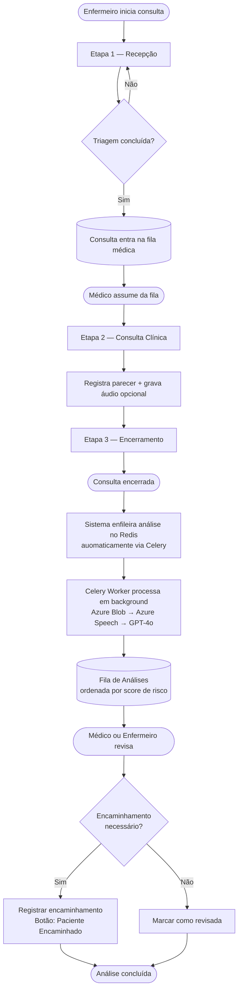
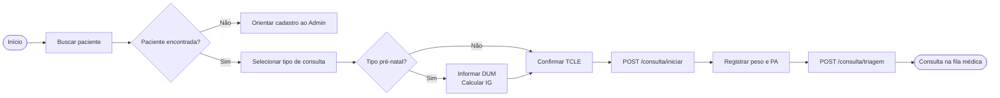
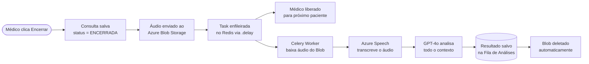
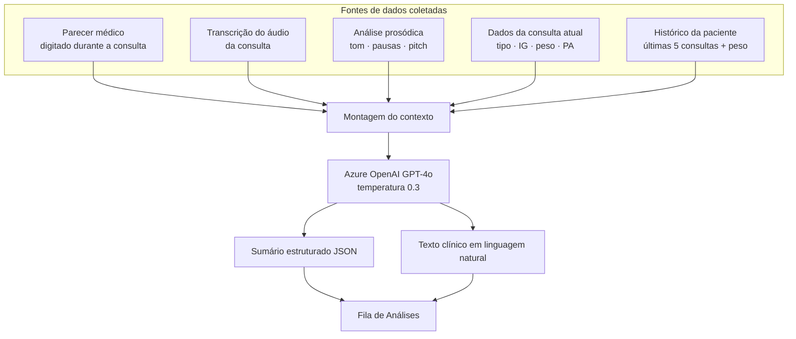
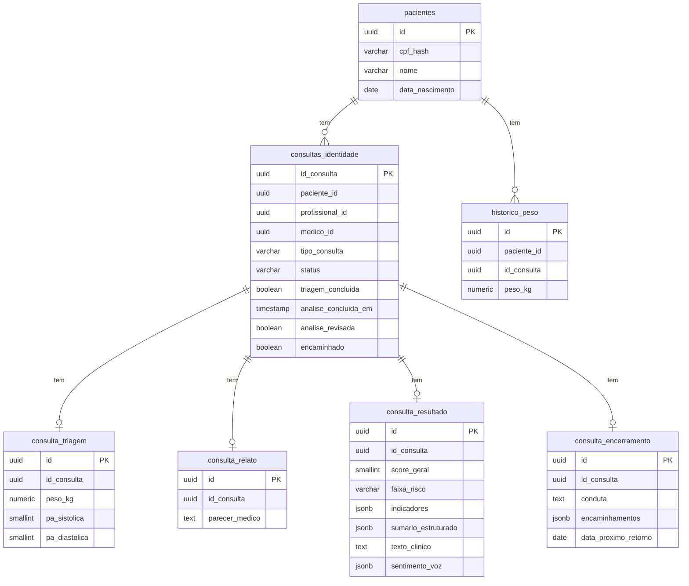

# CASF — Centro de Assistência à Saúde Feminina
## Fluxo de Atendimento e Análise Inteligente

---

## Sumário

1. [Visão Geral](#1-visão-geral)
2. [Perfis de Acesso](#2-perfis-de-acesso)
3. [Fluxo Completo de Atendimento](#3-fluxo-completo-de-atendimento)
4. [Etapa 1 — Recepção](#4-etapa-1--recepção)
5. [Etapa 2 — Consulta Clínica](#5-etapa-2--consulta-clínica)
6. [Etapa 3 — Encerramento](#6-etapa-3--encerramento)
7. [Fila de Consultas Médicas](#7-fila-de-consultas-médicas)
8. [Pipeline de Análise de IA](#8-pipeline-de-análise-de-ia)
9. [Fila de Análises](#9-fila-de-análises)
10. [Arquitetura de Dados](#10-arquitetura-de-dados)
11. [Segurança e LGPD](#11-segurança-e-lgpd)

---

## 1. Visão Geral

O CASF é um sistema de apoio clínico para unidades básicas de saúde (UBS) focado
na saúde feminina. Seu diferencial está na **detecção automática de anomalias
pós-consulta** — após cada atendimento, o sistema processa automaticamente o
parecer médico e o áudio da consulta para identificar indicadores de risco
psicossocial como depressão perinatal, ansiedade e violência doméstica.

O resultado da análise não interrompe o fluxo de atendimento. O médico
encerra a consulta normalmente e continua atendendo. Quando a IA detecta
algo relevante, a equipe é notificada pela **Fila de Análises**, onde médico
e enfermeiro podem revisar os indicadores e registrar os encaminhamentos
necessários.

O sistema não faz diagnósticos. Atua como uma camada de vigilância clínica
contínua, ampliando a capacidade de detecção da equipe sem gerar interrupções
no atendimento.

---

## 2. Perfis de Acesso

| Perfil | Responsabilidades |
|---|---|
| **Admin** | Cadastro e gestão de pacientes |
| **Enfermeiro** | Recepção, identificação, triagem e revisão da fila de análises |
| **Médico** | Consulta clínica, encerramento e revisão da fila de análises |

---

## 3. Fluxo Completo de Atendimento



---

## 4. Etapa 1 — Recepção

**Responsável:** Enfermeiro

A recepção é dividida em dois blocos executados em sequência na mesma tela.

### 4.1 Identificação

O enfermeiro busca a paciente por nome, CPF ou CNS. A paciente deve estar
previamente cadastrada pelo Admin com dados como nome, data de nascimento,
estado civil, altura e histórico de filhos.

Após localizar a paciente, o enfermeiro define:

- **Tipo de consulta:** Pré-natal, Ginecológica, Puerpério ou Planejamento Familiar
- **DUM** (Data da Última Menstruação): obrigatória para consultas de pré-natal,
  usada para calcular automaticamente a Idade Gestacional (IG)
- **TCLE:** confirmação de que a paciente assinou o Termo de Consentimento Livre
  e Esclarecido para gravação de áudio

> 📷 _[Print: tela de identificação com busca de paciente e formulário de dados da consulta]_

### 4.2 Triagem

Com a consulta criada, o enfermeiro registra os dados vitais mínimos:

| Campo | Descrição |
|---|---|
| Peso (kg) | Registrado em histórico por consulta |
| Pressão Arterial Sistólica (mmHg) | — |
| Pressão Arterial Diastólica (mmHg) | — |

Ao concluir a triagem, a consulta é automaticamente inserida na **fila médica**
da UBS, aguardando o médico assumir o atendimento.

> 📷 _[Print: tela de triagem com campos de peso e PA]_

### 4.3 Diagrama da Etapa 1



---

## 5. Etapa 2 — Consulta Clínica

**Responsável:** Médico

O médico acessa a fila, assume a primeira consulta disponível e é direcionado
diretamente para esta etapa. Um card colapsável no topo exibe o resumo da
triagem realizada pelo enfermeiro, incluindo o **histórico de peso das últimas
5 consultas** em formato de tabela com variação entre registros e indicador
de tendência.

### 5.1 Parecer Médico

O médico registra livremente seu parecer sobre a paciente — sintomas relatados,
comportamento observado, contexto social e qualquer informação relevante
captada durante o atendimento. O texto é salvo automaticamente à medida que
o médico escreve.

### 5.2 Gravação de Áudio (opcional)

Em paralelo ao parecer, o médico pode iniciar a gravação de áudio da consulta
com um único clique. O áudio captura a conversa completa entre médico e
paciente. O áudio é armazenado temporariamente apenas durante o processamento
e **descartado automaticamente** após a extração da transcrição.

> 📷 _[Print: tela de consulta com campo de parecer médico e controles de gravação]_

---

## 6. Etapa 3 — Encerramento

**Responsável:** Médico

O médico encerra a consulta registrando conduta, encaminhamentos (se houver),
data do próximo retorno e observações opcionais. Ao confirmar o encerramento,
o sistema dispara automaticamente a análise de IA em background — sem nenhuma
ação adicional do médico.

### 6.1 Campos

| Campo | Descrição |
|---|---|
| **Conduta adotada** | Texto livre registrado pelo médico |
| **Encaminhamentos** | Seleção múltipla opcional |
| **Próximo retorno** | Data calculada automaticamente por IG e faixa de risco, ajustável |
| **Observações** | Campo livre opcional |

### 6.2 Cálculo do Próximo Retorno

| Faixa de Risco | Prazo base |
|---|---|
| Verde | 30 dias |
| Amarelo | 14 dias |
| Laranja | 7 dias |
| Vermelho | 2 dias |

Para consultas de pré-natal, o prazo é ajustado também pela IG:
IG < 28 semanas → máximo 28 dias; IG 28–36 semanas → máximo 14 dias;
IG > 36 semanas → máximo 7 dias. O menor prazo entre os dois critérios é aplicado.

### 6.3 O que acontece ao encerrar



### 6.4 Exportação para e-SUS PEC

O sistema gera um **resumo em PDF** com os dados relevantes da consulta para
facilitar o registro manual no sistema oficial do SUS.

> 📷 _[Print: tela de encerramento com campos de conduta]_

> 📷 _[Print: tela de conclusão com botão de download do PDF]_

---

## 7. Fila de Consultas Médicas

**Responsável:** Médico

A fila centraliza as consultas com triagem concluída aguardando atendimento.

- Ordenação por **FIFO** — primeira triagem concluída é a primeira atendida
- Escopo restrito à **mesma UBS** do médico logado
- Atualização automática a cada 30 segundos
- Ao assumir: médico é direcionado para a Etapa 2 com resumo da triagem
  e histórico de peso visíveis no topo

> 📷 _[Print: fila de consultas médicas com cards de pacientes aguardando]_

---

## 8. Pipeline de Análise de IA

Esta é a etapa central do sistema. O pipeline é executado automaticamente
após o encerramento de cada consulta, combinando cinco fontes de dados e
processando com o modelo **Azure OpenAI GPT-4o**.

### 8.1 Fontes de Dados



### 8.2 Processamento do Áudio

O áudio passa por duas etapas antes de chegar ao GPT-4o:

**1. Transcrição com diarização** via Azure Speech SDK
O serviço separa automaticamente as falas do médico e da paciente
(diarização por falante), produzindo uma transcrição rotulada que identifica
quem disse cada trecho.

**2. Análise prosódica**
Sobre a fala isolada da paciente, o sistema extrai:

| Indicador | Descrição |
|---|---|
| Tom geral | Classificado como: neutro, ansioso, triste ou agitado |
| Pausas longas | Detecção de pausas superiores a 3 segundos |
| Variação de pitch | Classificada como: baixa, normal ou alta |

### 8.3 Indicadores de Risco

O GPT-4o identifica e classifica quatro categorias de indicadores:

| Indicador | Nível | Exemplos de evidências detectadas |
|---|---|---|
| **Depressão** | Baixo / Moderado / Alto | choro frequente, falta de ânimo, isolamento, pensamentos negativos |
| **Ansiedade** | Baixo / Moderado / Alto | insônia, taquicardia, ruminação, medo de sair de casa |
| **Violência Doméstica** | Baixo / Moderado / Alto | hesitação ao falar do parceiro, medo verbalizado, marcas inexplicadas |
| **Isolamento Social** | Baixo / Moderado / Alto | afastamento de amigos, ausência de rede de apoio, solidão |

### 8.4 Score e Faixa de Risco

| Faixa | Score | Significado |
|---|---|---|
| 🟢 **Verde** | 0 – 25 | Nenhum indicador significativo |
| 🟡 **Amarelo** | 26 – 50 | Indicadores leves — atenção recomendada |
| 🟠 **Laranja** | 51 – 75 | Indicadores moderados — intervenção recomendada |
| 🔴 **Vermelho** | 76 – 100 | Indicadores críticos — encaminhamento imediato |

### 8.5 Fallback

Se o Azure OpenAI estiver indisponível, o sistema aciona automaticamente
uma análise local baseada em dicionário de palavras-chave. O resultado é
entregue normalmente com um aviso indicando o modo de fallback.

### 8.6 Responsabilidade Clínica

O aviso abaixo é exibido permanentemente na tela de resultado:

> _"Esta análise é um apoio à decisão clínica gerado por inteligência artificial.
> O diagnóstico e a conduta final são responsabilidade exclusiva do profissional
> de saúde."_

---

## 9. Fila de Análises

**Responsável:** Médico e Enfermeiro

A Fila de Análises centraliza todas as análises de IA concluídas e ainda
não revisadas da UBS. É independente do fluxo de atendimento — o médico
pode revisá-la a qualquer momento, sem interromper as consultas em andamento.

### 9.1 Ordenação e filtros

- Ordenação por **score decrescente** — análises com maior risco aparecem primeiro
- Dentro da mesma faixa: mais antiga primeiro
- Exibe todas as consultas não revisadas, independente do dia
- Escopo restrito à mesma UBS do profissional logado
- Atualização automática a cada 60 segundos

### 9.2 Visualização da fila

Cada item exibe:

| Elemento | Descrição |
|---|---|
| Chip de faixa de risco | Cor e texto indicando VERDE / AMARELO / LARANJA / VERMELHO |
| Score numérico | Ex: "82/100" |
| Nome da paciente | — |
| Tipo de consulta + IG | — |
| Data da consulta | "Hoje às 14h32" ou data completa |
| Indicadores críticos | Chips com os indicadores classificados como ALTO |

Cards com faixa LARANJA ou VERMELHO são destacados com borda lateral colorida.
A fila é separada visualmente por grupos de faixa:

> **— Risco Crítico (2) —** → **— Risco Elevado (3) —** → **— Atenção (5) —** → ...

> 📷 _[Print: fila de análises com cards ordenados por score e separadores de faixa]_

### 9.3 Detalhe da análise

Ao clicar em qualquer item da fila, abre a tela de detalhe com:

- **Score e faixa de risco** com indicador visual colorido
- **Indicadores detectados** em cards com evidências e recomendações,
  organizados por criticidade
- **Texto clínico** gerado pelo GPT-4o em linguagem de laudo, editável
- **Parecer original** registrado pelo médico durante a consulta (somente leitura)
- **Resumo da triagem** com histórico de peso (colapsável)

> 📷 _[Print: tela de detalhe com score, indicadores em cards e texto clínico]_

### 9.4 Ações disponíveis

| Ação | Descrição |
|---|---|
| **Paciente Encaminhado** | Registra que a paciente foi encaminhada. Solicita observação opcional. Remove da fila. |
| **Revisar sem encaminhar** | Marca como revisada sem encaminhamento. Remove da fila. |
| **Voltar** | Retorna para a fila sem registrar nenhuma ação. |

Após qualquer ação, a análise sai da fila principal e fica disponível
no **histórico de análises revisadas** para consulta futura.

---

## 10. Arquitetura de Dados

O sistema utiliza um único banco PostgreSQL.



### Pseudonimização do CPF

O CPF da paciente nunca é armazenado em texto puro:

```
cpf_hash = SHA-256(cpf + SECRET_SALT)
```

O `SECRET_SALT` é mantido exclusivamente em variável de ambiente.

---

## 11. Segurança e LGPD

| Requisito | Implementação |
|---|---|
| CPF protegido | SHA-256 com salt — nunca armazenado puro |
| Áudio temporário | Salvo no Azure Blob Storage (`casf-audio-temp`) apenas durante o processamento; deletado no bloco `finally` do Celery worker |
| Áudio nunca no banco | Não existe campo de áudio em nenhuma tabela do PostgreSQL |
| Análise desacoplada | Task enfileirada no Redis — resultado não bloqueia o atendimento |
| Resiliência | Se a API reiniciar, a task permanece na fila Redis e é processada assim que o worker estiver disponível |
| Acesso por UBS | Profissional acessa apenas consultas da própria UBS |
| Timeout automático | Consultas abertas há mais de 4h são encerradas pelo sistema |
| Dados ao GPT-4o | Apenas dados clínicos — CPF e nome nunca enviados |
| Base legal LGPD | Consentimento explícito via TCLE (Art. 11, I) |
| Auditoria | Tabela imutável de acessos com trigger bloqueando UPDATE/DELETE |

---

*Documento gerado para entrega acadêmica do projeto CASF.*
*Versão 1.2 — MVP*
